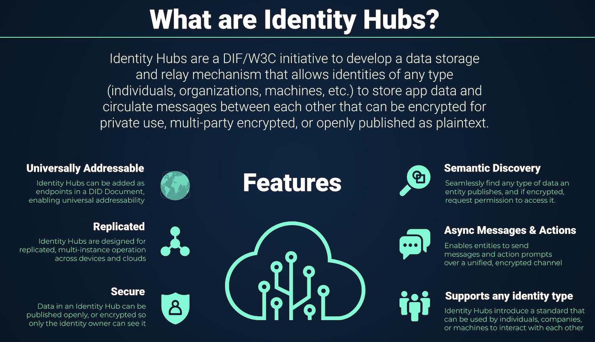
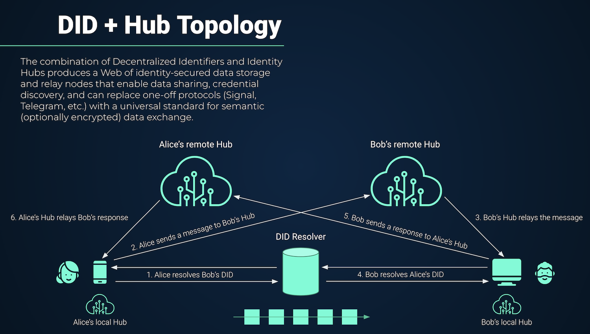

# Zion Relay v2

The new Zion relay server for decentralized social media and messaging.

## Features
- Decentralized message & media storage via [Identity Hubs](https://identity.foundation/identity-hub/spec/) and IPFS
- Account system for Bitcoin micropayments via Lightning
  - Connects to a funding source - initially [LND](https://github.com/lightningnetwork/lnd)

## Tech Stack
- [Go](https://go.dev/) 1.17
- [LND](https://github.com/lightningnetwork/lnd) - Lightning integration
- [IPFS](https://docs.ipfs.io/concepts/what-is-ipfs/) - Decentralized media storage
- [ION](https://identity.foundation/ion/) - DIDs anchored to Bitcoin

## Specifications
We will gradually implement the following specifications:
- [Identity Hub](https://identity.foundation/identity-hub/spec) (DIF)
- [Decentralized Identifiers](https://www.w3.org/TR/did-core/) (W3C)
- [Verifiable Credentials](https://www.w3.org/TR/vc-data-model/) (W3C)

## Media hosting

Relays can set their own rules for:

- What sorts of media are accepted
- How much media uploads cost (in sats)
- Who may upload media
  - Zion-hosted relays may restrict media uploads to paying customers

## Who runs relays?

Zion runs a series of relays. The Zion v2 app connects to them by default.

Anyone can run their own relay. Users can connect their app to these other relays.

## Identity Hub architecture

Courtesy of [DIF](https://identity.foundation/)

### DID Resolver

Make some researches about DID Resolver

  - https://github.com/TBD54566975/did-sdk
  - https://github.com/nuts-foundation/go-did
  - https://github.com/ockam-network/did
  - https://github.com/hyperledger/aries-framework-go